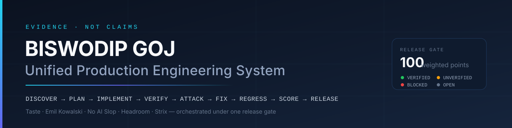

<!-- SPDX-License-Identifier: Apache-2.0 -->
<!-- Copyright (c) 2026 Biswodip Goj -->

<p align="center">
  
</p>

<h1 align="center">BISWODIP GOJ — UNIFIED ENGINEERING</h1>

<p align="center">
  <b>An execution system for AI coding agents.</b><br>
  Discover → plan → threat model → implement → verify → attack → fix → regress → score → release-gate.<br>
  Nothing is called done without evidence.
</p>

<p align="center">
  <a href=".github/workflows/ci.yml"></a>
  <a href="LICENSE"></a>
  <a href="CHANGELOG.md"></a>
  <a href="package.json">= 18.17" src="https://img.shields.io/badge/node-%E2%89%A5%2018.17-0B1220?style=for-the-badge&labelColor=0B1220&color=3C873A"></a>
  <a href="integrations/manifest.json"></a>
  <a href="references/02-master-shipping-gate.md"></a>
  <a href="SECURITY.md"></a>
</p>

<p align="center">
  <a href="#quick-start">Quick start</a> ·
  <a href="#what-this-is">What this is</a> ·
  <a href="#the-skills">Skills</a> ·
  <a href="#the-five-integrations">Integrations</a> ·
  <a href="#repository-layout">Layout</a> ·
  <a href="#command-reference">Commands</a> ·
  <a href="#release-gate">Release gate</a> ·
  <a href="#licence-and-attribution">Licence</a>
</p>

---

## Quick start

**Clone this repo, install it into a target project, then type `/dip`.** Full walkthrough: [`START-HERE.md`](START-HERE.md).

```bash
# from anywhere: clone this repo and install into a target project
curl -fsSL https://raw.githubusercontent.com/Biswadipgoj/BISWODIP-ENGINEERING-skills/main/install.sh | bash

# or
npx --yes github:Biswadipgoj/BISWODIP-ENGINEERING-skills dip install --root .
```

Then, in that project:

| Command | Does |
|---|---|
| `/dip` · `/dip android app with login` | Plans the goal, picks the few skills and libraries it needs, runs specialist subagents, verifies with evidence |
| `/dip-setapi <base-url> <key> <model>` | Saves your LLM gateway once; every tool that needs a model gets it automatically |
| `/dip:plan <goal>` | Shows the plan only (skills, stack, agents, waves), changes nothing |
| `/dip:bootstrap` | Detect and install the five integrations |
| `/dip:security src/api` | Server-authoritative review, a status per control |
| `/dip:pentest http://127.0.0.1:3000 quick` | Authorized pentest, then the fix loop |
| `/dip:design checkout page` | States, responsive, accessibility, anti-slop copy |
| `/dip:release` | Evidence matrix, score, blockers, report |
| `/dip:handoff` | Writes `handoff.md` for the next session |
| `@dip` | The same agent, in any conversation |

Or install the skills alone, straight from this repository:

```bash
npx skills add Biswadipgoj/BISWODIP-ENGINEERING-skills                                   # all eight
npx skills add Biswadipgoj/BISWODIP-ENGINEERING-skills --skill biswodip-security-review  # just one
```

Or clone it and let the installer wire up the upstream projects too:

```bash
# 1. From your target project, detect what already exists (nothing is installed yet)
node /path/to/BISWODIP-ENGINEERING-skills/bin/biswodip.mjs detect --root .

# 2. Clone every upstream repository, verify each one, install the agent skills
bash /path/to/BISWODIP-ENGINEERING-skills/scripts/install-integrations.sh .

# 3. Confirm what is installed, against the lock file
bash /path/to/BISWODIP-ENGINEERING-skills/scripts/verify-integrations.sh . --verbose

# 4. Run the automated security gates
bash /path/to/BISWODIP-ENGINEERING-skills/scripts/run-security-gates.sh . --project-checks
```

Windows PowerShell:

```powershell
& C:\path\to\BISWODIP-ENGINEERING-skills\scripts\install-integrations.ps1 -Root .
```

Then tell your agent: **“Follow MASTER-PROMPT.md for this repository.”** Installed as a skill, it triggers on its own for build, harden, review, audit, pentest and release-gate work.

> Reproducible setup: add `--pinned` to check out the exact commits recorded in `integrations/manifest.json`. Air-gapped setup: add `--offline` to use the source snapshots bundled in `upstream/`.

---

## The skills

Eight skills, each installable on its own. The router carries the law and the map; everything else loads only when its phase runs — so a typo fix does not drag a release gate into your context.

| Skill | Use it for | Loads on trigger |
|---|---|---:|
| `biswodip-unified-engineering` | The laws, the 14 phases, the routing table — start here | **~1.4k tokens** |
| `biswodip-orchestrator` | Auto-plan: stack catalog, subagent waves, `/dip-setapi` gateway | ~1.6k |
| `biswodip-bootstrap` | Detect and install the five integrations without duplicating anything | ~0.8k |
| `biswodip-security-review` | Secrets, authn, authz, money, webhooks, API, files, privacy, AI features | ~1.3k |
| `biswodip-pentest` | Authorized Strix run, manual adversarial pass, the fix loop | ~1.3k |
| `biswodip-design-review` | States, responsive, accessibility, motion, anti-slop copy | ~0.9k |
| `biswodip-release-gate` | Evidence matrix, score with caps, blockers, final report | ~1.1k |
| `biswodip-handoff` | `handoff.md` — goal, state, files, changes, failed attempts, next steps | ~0.9k |

Before v2.1.0 one skill loaded the whole system — ~12,900 tokens — on every trigger. Details and reading habits: [`docs/CONTEXT-BUDGET.md`](docs/CONTEXT-BUDGET.md).

### Handing work to the next session

```bash
node bin/biswodip.mjs handoff init     # scaffold handoff.md with the six sections
node bin/biswodip.mjs handoff update   # refresh git + evidence facts, keep your prose
```

Write it at ~70% context, not at 95%. Section 5 (failed attempts) is the one that saves the next session the most work.

---

## What this is

Most AI output looks finished. This system exists to make it *be* finished.

It is a single operating document (`MASTER-PROMPT.md`, §0–§43) plus the procedures, security deep-dives, verification catalogue, tooling and templates an agent needs to take a repository from discovery to release.

**The rules that do the work:**

| Rule | Meaning |
|---|---|
| Evidence, not claims | "tested", "secure", "production ready" require a recorded command, result and artifact. Anything else is `UNVERIFIED` or `BLOCKED`. |
| The client is untrusted | Identity, role, tenant, ownership, price, amount and state are decided server-side, every request. |
| Attack your own work | After implementing, switch sides: IDOR, escalation, replay, races, webhook forgery, SSRF, traversal, exhaustion, prompt injection. |
| Fix root causes | Reproduce, fix at the boundary, add a regression test, re-run the exploit, test the neighbours. |
| Score from evidence | 100 weighted points, hard caps for unresolved criticals, and blockers that override the number. |
| One honest status | `RELEASE READY` · `RELEASE READY WITH DOCUMENTED ACCEPTED RISKS` · `NOT RELEASE READY` · `BLOCKED — INSUFFICIENT EVIDENCE`. |

**What it refuses to do:** add technology to look sophisticated, invent test results, call a scanner run proof of security, trust a client field, hide a finding, or scan a target you have not been explicitly authorized to test.

---

## Auto-planning and subagents

`/dip <goal>` runs a deterministic planner over the repository and the goal, and keeps only the **few** entries the goal needs from a **46-repository capability registry** (`repositories/INDEX.md`, planner source `integrations/catalog.json`). All 37 specification repositories are registered — jev-ultrafast (the default browser driver, instead of Playwright), Motion, Anime.js, Animate.css, Bootstrap, Font Awesome, css.gg, Impeccable, Front-End Checklist, React Native, Expo, Appwrite, Prisma, Redis, Meilisearch, ClickHouse, TiDB, Netdata, Keploy, Open Code Review, Archify, Superpowers, Matt Pocock's skills, the official Claude plugins, Ruflo, Paperclip, Crawlee, Scrapling, n8n, Kubernetes The Hard Way, Awesome Scalability, Codex Security, SQLMap, Awesome Hacking, the Cloudflare Security Audit Skill, Awesome Claude Code and App Ideas — plus design-engineering skills (Emil Design Eng, Make Interfaces Better, React Doctor, Fixing Accessibility, 12 Principles of Animation, shadcn/ui), `agent-reach` for research, and `browser-use` as the jev-ultrafast fallback. It then runs subagents in waves:

```text
Plan    dip-planner                  criteria, tasks, one owner per file area
Build   dip-frontend · dip-mobile · dip-backend · dip-browser · dip-infra   (parallel)
Verify  dip-quality · dip (security review)                                 (parallel)
Gate    main agent → fixes → release gate → one status
```

Every registry entry carries `required`, `planner_triggers`, `integration_type` and `security_notes`. Registered is not the same as installed: the planner evaluates all of them and activates only what the goal needs. Security entries are permission-aware — `sqlmap` is authorized-only, and `codex-security`, `awesome-hacking` and `cloudflare-security-audit` are references whose output is data, never instruction.

```bash
dip plan --root . "android app with login and animations"   # → .biswodip/PLAN.md
dip add prisma,redis --root .                                # install what the plan picked
dip setapi --base-url https://openrouter.ai/api/v1 --model <model>   # key prompted hidden
dip exec --for open-code-review -- ocr …                     # tool runs with its variables filled
```

Keys live in `~/.config/biswodip/llm.json` (owner-only, never in a project). Details: [`docs/ORCHESTRATION.md`](docs/ORCHESTRATION.md) · [`docs/LLM-GATEWAY.md`](docs/LLM-GATEWAY.md).

---

## The five integrations

Each is cloned at install time **and** bundled here as an exact source snapshot, with its own licence preserved.

| Integration | Upstream | Licence | Used for |
|---|---|---|---|
| **Taste Skill** | [Leonxlnx/taste-skill](https://github.com/Leonxlnx/taste-skill) | MIT | Anti-slop frontend design — 13 skills (Phase 8) |
| **Emil Kowalski Skills** | [emilkowalski/skills](https://github.com/emilkowalski/skills) | MIT | Design engineering and motion — 13 skills (Phase 8) |
| **No AI Slop** | [petergyang/no-ai-slop](https://github.com/petergyang/no-ai-slop) | MIT | UI copy, docs and report writing (§43) |
| **Headroom** | [headroomlabs-ai/headroom](https://github.com/headroomlabs-ai/headroom) | Apache-2.0 | Agent context/token compression (Phase 9) |
| **Strix** | [usestrix/strix](https://github.com/usestrix/strix) | Apache-2.0 | Authorized autonomous pentesting — 9 skills (Phase 11) |

The installer detects what is already present, never reinstalls it blindly, never duplicates a skill across scopes, verifies every checkout (remote URL, expected files, licence file) and records it in the lock.

```text
INTEGRATION | STATUS | VERSION | SOURCE | LOCATION | ACTION TAKEN
```

---

## Repository layout

```text
BISWODIP-ENGINEERING-skills/
├── MASTER-PROMPT.md          # the operating system: §0–§43
├── lifecycle/                # 00-bootstrap … 13-release — one procedure per phase
├── security/                 # server authority, authorization, financial, webhooks,
│                             #   data protection, attack catalogue
├── references/               # carried forward from v1.2.0, verbatim — including the
│                             #   2,215-item verification gate catalogue
├── integrations/             # manifest.json + one brief per integration + the 46-repo catalog.json
├── repositories/             # Repository Capability Registry — INDEX.md + catalog.json
├── upstream/                 # exact source snapshots of all five upstream repositories
├── scripts/                  # detect / install / verify / run-security-gates / build-repository-registry
├── bin/biswodip.mjs          # single cross-platform entry point
├── reports/                  # release report, evidence matrix, finding, exception,
│                             #   threat model, authorization matrix, integration record
├── site/                     # animated portfolio site (Next.js + Framer Motion, Vercel-ready)
├── skills/                   # 7 generated installable skills (built from MASTER-PROMPT.md + skills-src/)
├── skills-src/               # the body of each skill (frontmatter is generated)
├── templates/claude/         # /dip commands + @dip agent, copied into your project's .claude/
├── START-HERE.md             # unzip → GitHub → install → /dip
├── ARCHITECTURE.md           # the nine layers, step by step
├── handoff.md                # session handoff: goal, state, files, changes, failures, next steps
├── docs/INSTALL.md           # every flag, every platform, troubleshooting
└── test/                     # unit tests for the tooling
```

---

## Command reference

```bash
node bin/biswodip.mjs <command> [options]
```

| Command | What it does |
|---|---|
| `detect` | Reports clones, skills, CLIs, Docker and env — installs nothing, prints no secret values |
| `install` | Clones every upstream repo (retries, verification, pinning, snapshot fallback), installs skills, writes the lock |
| `verify` | Checks an installed project against its lock file — commit drift, licence hash, skill presence |
| `gates` | Secret scan, code-risk hints, dependency audits, optional project checks and Strix run → JSON + Markdown evidence |
| `strix` | Guarded pentest: loopback only unless `--authorized-host`, key never printed, verdict read from `run.json` |
| `doctor` | `detect` plus the exact command that fixes each gap |
| `handoff` | `init` / `update` / `show` — the six-section handoff file for the next session |
| `plan` · `catalog` · `add` | Plan a goal against the stack catalog; list it; install entries (manual ones are printed, never run) |
| `setapi` · `api` · `exec` | Save the LLM gateway; show / test / env / clear it; run a tool with it injected |
| `skills` | Lists the installable skills and what each costs in context |
| `verify-package` | Self-check of this package: tree, sections, path resolution, gate count, skill sync, snapshot hashes, licences, SPDX headers, script parsing, secret scan |
| `build-skill` · `refresh-snapshots` | Maintainer: regenerate the skill; re-clone upstream and update the manifest |

Docs: [`START-HERE.md`](START-HERE.md) · [`ARCHITECTURE.md`](ARCHITECTURE.md) · [`docs/INSTALL.md`](docs/INSTALL.md) · [`docs/GITHUB.md`](docs/GITHUB.md) · [`docs/CONTEXT-BUDGET.md`](docs/CONTEXT-BUDGET.md)

Useful flags: `--pinned` · `--update` · `--offline` · `--with-tools` · `--agent codex` · `--global` · `--dry-run` · `--only strix` · `--json` · `--strict`. Full list: `node bin/biswodip.mjs --help`.

---

## Release gate

Score only from evidence; hard blockers override the number.

| Category | Weight |  | Category | Weight |
|---|---:|---|---|---:|
| Security | 25 | | Architecture / maintainability | 10 |
| Correctness / business integrity | 20 | | Performance | 5 |
| Reliability | 15 | | Accessibility / responsive UX | 5 |
| Test / evidence quality | 15 | | Design / interaction | 5 |

Caps: unresolved Critical, authorization bypass, exposed secret or unsafe financial transition → **max 49, blocked**. Unresolved High in an exposed path → **max 69, blocked**. Fabricated or missing evidence still counts as a failure.

Blocked outright by: critical vulnerability · exposed production secret · broken authorization · cross-tenant access · authentication bypass · unsafe financial state transition · known data exposure or tampering.

---

## Authorized testing only

Penetration testing — with Strix or by hand — is permitted **only** against systems you own or are explicitly authorized to test, in a disposable environment, with test identities and provided scope.

---

## Licence and attribution

This system — the operating document, lifecycle, security deep-dives, verification and scoring model, tooling, templates and documentation — is **Copyright (c) 2026 Biswodip Goj**, licensed under the Apache License 2.0.

The projects under `upstream/` are **not** the work of Biswodip Goj. They are redistributed unmodified under their own licences, with every copyright, licence and notice file preserved — see [`THIRD-PARTY-NOTICES.md`](THIRD-PARTY-NOTICES.md).

Verify that claim yourself:

```bash
node bin/biswodip.mjs verify-package --verbose
```

<p align="center"><sub><b>SHIP ONLY WHAT CAN BE EXPLAINED, VERIFIED, MONITORED, AND RECOVERED.</b></sub></p>
